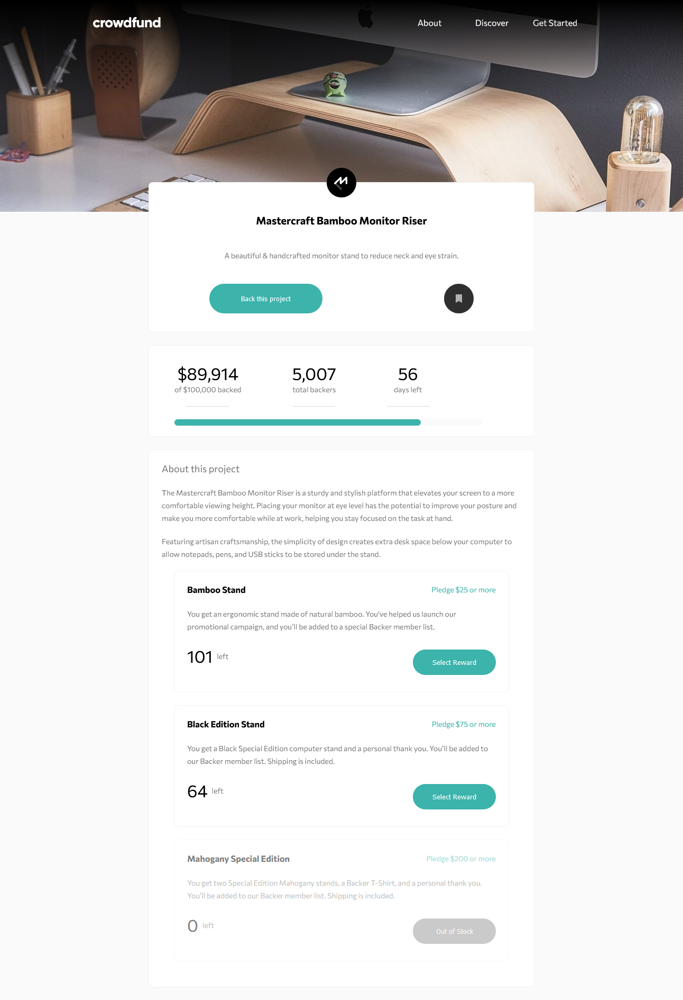

# Frontend Mentor - Crowdfunding product page solution

This is a solution to the [Crowdfunding product page challenge on Frontend Mentor](https://www.frontendmentor.io/challenges/crowdfunding-product-page-7uvcZe7ZR). Frontend Mentor challenges help you improve your coding skills by building realistic projects. 

## Table of contents

- [Overview](#overview)
  - [The challenge](#the-challenge)
  - [Screenshot](#screenshot)
  - [Links](#links)
- [My process](#my-process)
  - [Built with](#built-with) 
  - [Useful resources](#useful-resources)
- [Author](#author)
- [Acknowledgments](#acknowledgments)

## Overview

### The challenge

Users should be able to:

- View the optimal layout depending on their device's screen size
- See hover states for interactive elements
- Make a selection of which pledge to make
- See an updated progress bar and total money raised based on their pledge total after confirming a pledge
- See the number of total backers increment by one after confirming a pledge
- Toggle whether or not the product is bookmarked

### Screenshot

### Links

- Solution URL: https://github.com/yurtsevero/_Frontendmentor.crowdfunding-product-page
- Live Site URL: https://yurtsevero.github.io/_Frontendmentor.crowdfunding-product-page/

## My process

### Built with

- Semantic HTML5 markup
- BEM methodology
- CSS3 , SASS 
- Flexbox
- Mobile-first workflow
- vanilla JavaScript

### Useful resources

- https://css-tricks.com/ - This helped me for how to use Flexbox . It is a great resource to have a look at it each time when I stuck in CSS.
- https://www.programiz.com/javascript - This helped me for some basic functions and properties to get me remind. 

## Author

- Linkedin- Onur Yurtsever - https://www.linkedin.com/in/oyurtsever/
- Frontend Mentor - @yurtsevero - https://www.frontendmentor.io/profile/yurtsevero

